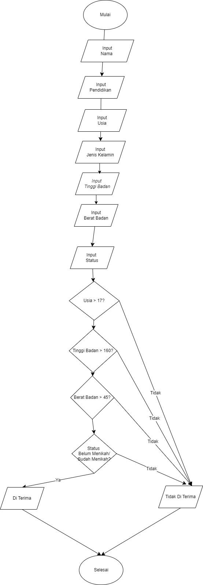

# PROGRAM PEKERJA FREELANCE

## STUDI KASUS 
karena saya pernah mengikuti freelance harian di sebuah PT, menurut saya cara mendaftar freelance harian tersebut tidak efisien karena banyak yang mendaftarkan secara offline sehingga berdesal-desakkan.

## Proses codingan

1. Inisialisasi Data

program diawali dengan tampilan judul "PEKERJA FREELANCE"

2. Input Data Seleksi Freelance

Program meminta yang mengikuti seleksi freelance untuk memasukkan data.

Data yang dimasukkan akan dievaluasi untuk menentukan hasil kelayakan orang yang ikut seleksi

3. Evaluasi Hasil

Program menggunakkan kondisi if untuk mengevaluasi apakah orang yang mengikuti seleksi freelance memenuhi persyaratan.

Jika orang yang mengikuti seleksi memenuhi semua persyaratan maka hasil orang yang mengikuti freelance akan 'Selamat Anda di terima freelance harian dan mengikuti training terlebih dahulu'

Jika tidak memenuhi semua persyaratan maka hasil orang yang mengikuti seleksi freelance kan 'Maaf Anda tidak di Terima'

## Langkah-langkah Program 

Berikut adalah langkah-langkah rinci berdasarkan program yang tertera :

1. Mulai terlebih dahulu

    Program menampilkan teks "SELEKSI FREELANCE" sebagai pengumuman.

2. Program meminta pengguna untuk memasukkan informasi pribadi berupa:
    >print nama_pekerja = str (input('Masukkan Nama :'))

    >print pendidikan_terakhir= str (input('Masukkan Pendidikan Anda :'))

    >print usia = int(input('Masukkan Usia :'))

    >print jenis_kelamin = str (input('Masukkan Jenis Kelamin :'))

    >print tinggi_badan = float(input('Masukkan Tinggi Badan :'))

    >print berat_badan = float(input('Masukkan Berat Badan :'))

    >print status = str(input('Masukkan Status Anda (Sudah Menikah/Belum Menikah):')) 

3. Program kemudian mengecek beberapa syarat:

Usia harus lebih dari 17 tahun

Tinggi badan harus lebih dari 155 cm

Berat badan harus lebih dari 45 kg

Status harus "Belum Menikah"

4. Jika semua syarat terpenuhi, program akan mencetak pesan bahwa pekerja diterima untuk posisi 
freelance dan harus mengikuti training terlebih dahulu.

5. Jika salah satu syarat tidak terpenuhi, program akan mencetak pesan bahwa pekerja tidak diterima
Program kemudian menampilkan hasil akhir sesuai dengan pengecekan syarat tersebut.

# FLOWCHART

